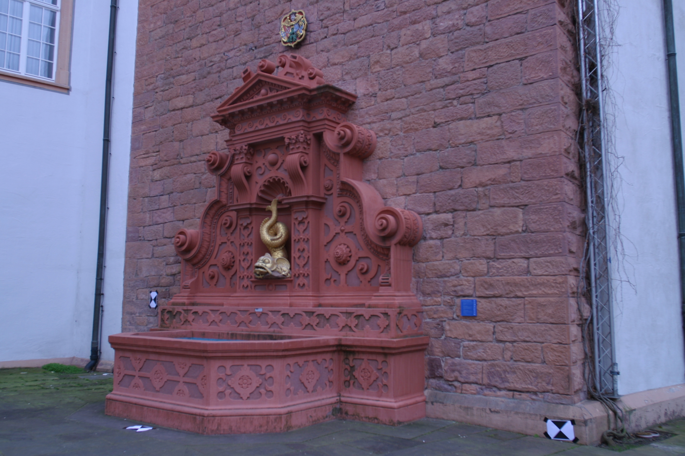
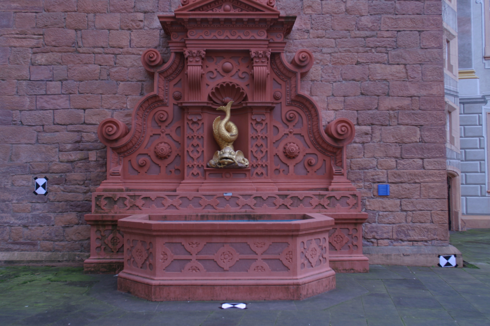
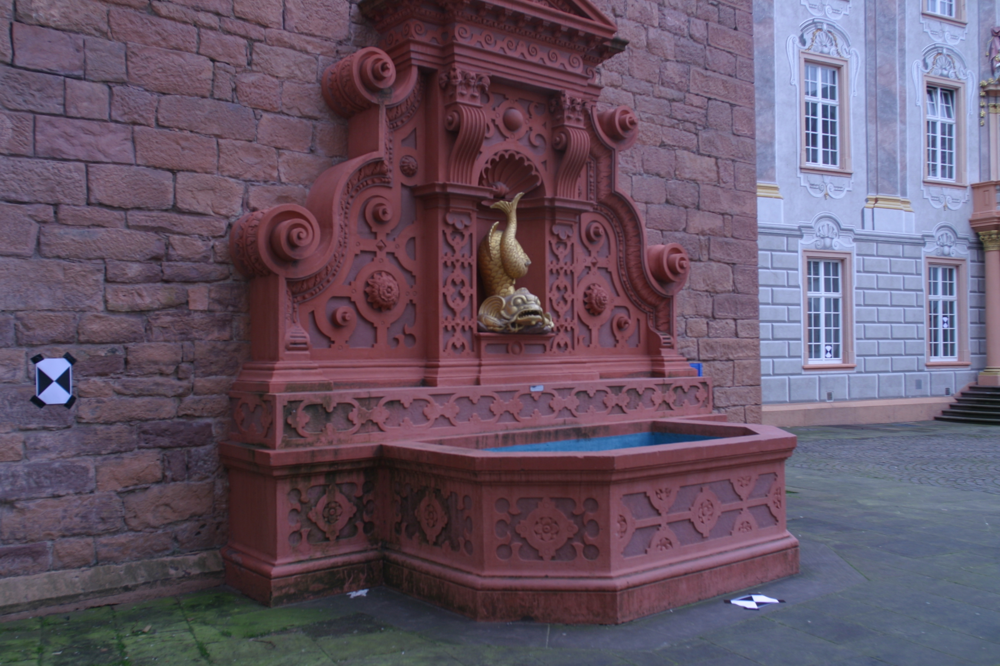
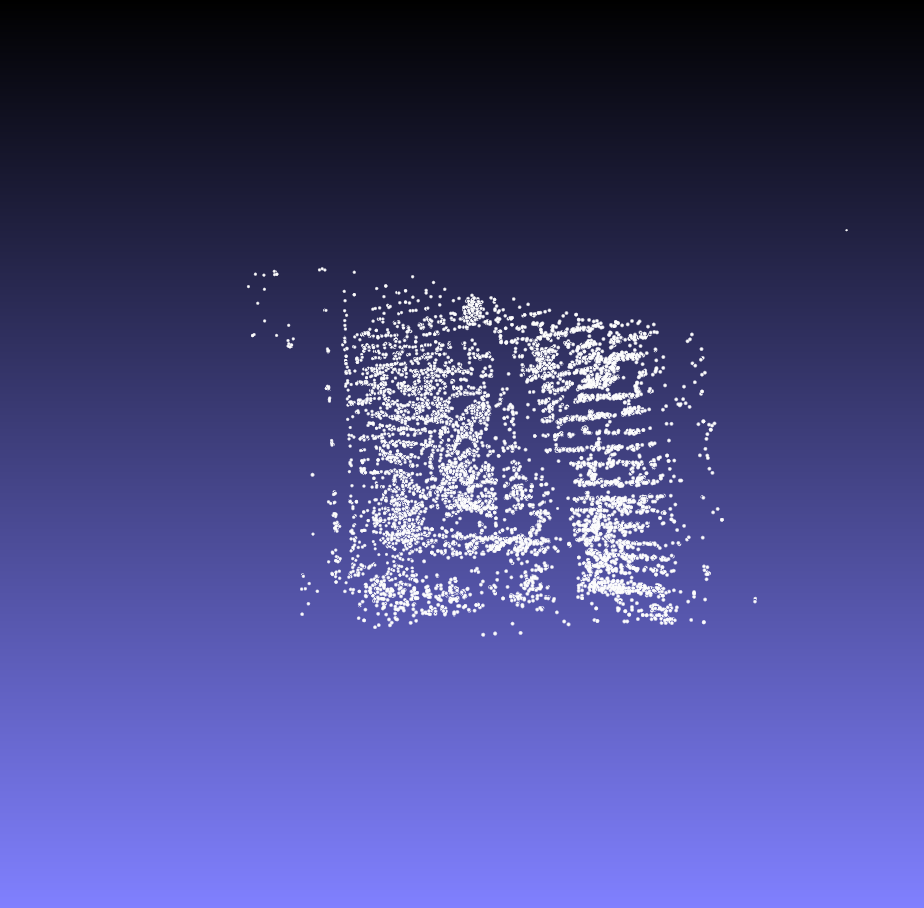
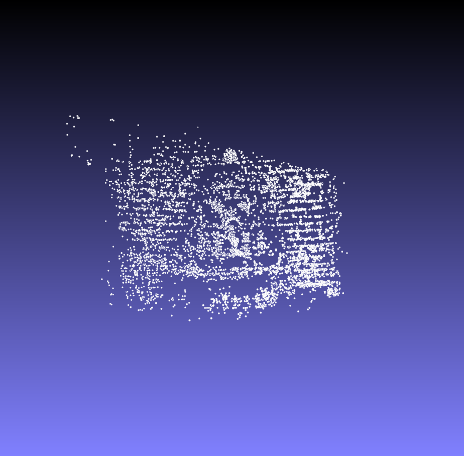
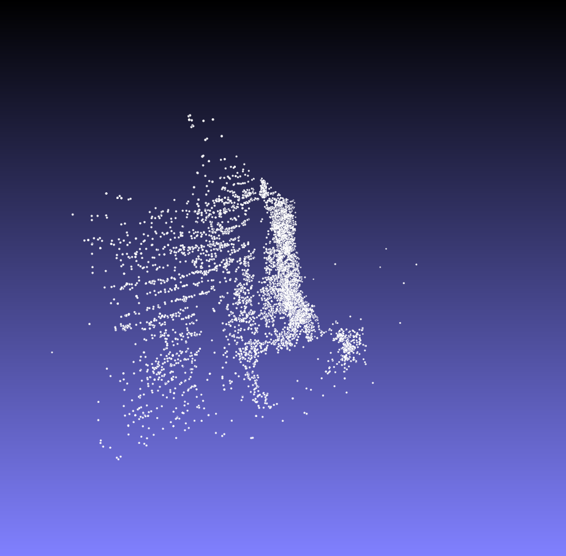
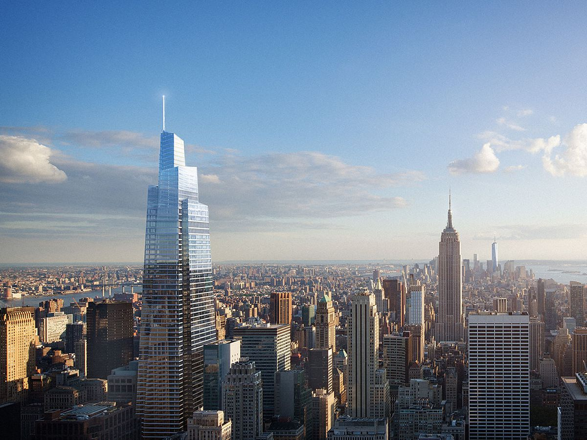
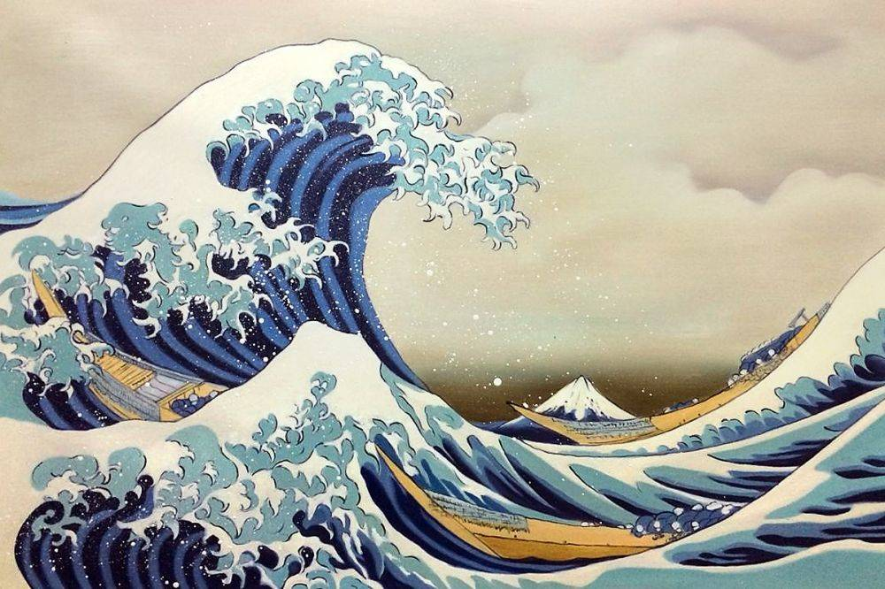
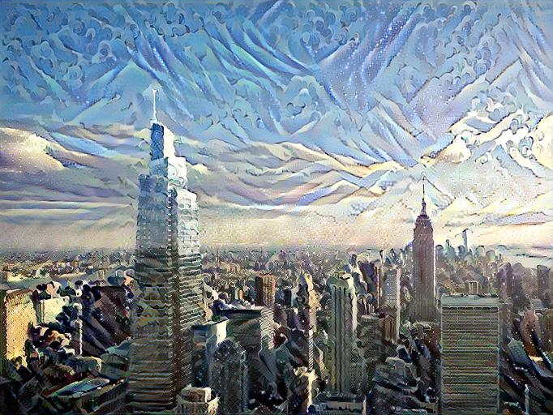

# About Me

Hi, I'm Devraj Priyadarshi!

An Undergraduate student at **IIT Kharagpur**, persuing a **Dual Degree (B. Tech + M. Tech)** in **Electronics & Electrical Communications Engineering** with specialization in **Vision and Intelligent Systems**. I'm currently working to learn more in fields of Vision and Robotics. 

# Interests

- **Robotics:** Autonomous UAVs, Control, Planning.
- **Computer Vision:** GANs, 3D Reconstruction, Segmentation and Detection.
- **Reinforcement Learning:** Learning based Control for UAVs.
- **Generative Art:** Flow Fields, Differential Lines. 

# Projects

<!-- ### Perception-Action-Coupled-Optimization-for-Landing (WIP) -->

### Sparse-3D-Reconstruction
Structure from motion is a technique to perceive depth by utilizing movement. Through SfM we can recover 3D structure of a scene by making use of a sequence of 2D images. [Project Link](https://github.com/devrajPriyadarshi/Sparse-3D-Reconstruction).

Images of Scene:

  
  
  

3D Reconstruction:

  
  
  

### Deep-Neural-Style-Transfer
Neural Transfer Style is one of the most amazing applications of Artificial Intelligence in a creative context, we choose an art painting style and transfer its style to a chosen image, creating stunning results. [Project Link](https://github.com/devrajPriyadarshi/Deep-Neural-Style-Transfer).

Based on the original paper : [A Neural Algorithm of Artistic Style](https://arxiv.org/abs/1508.06576)

  Content Image + style Image = Generated Image

  

  
  
  

  
